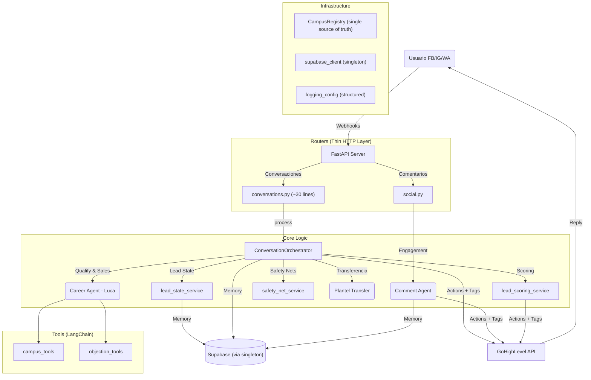

# Sistema de Asistente de Admisiones - Colegio San Angel

> **Version 1.0** | Arquitectura Agentica Neuro-Simbolica
> **Autor:** Jose Angel Balbuena Palma

## El Porque del Agente

Esta es una **solucion de vanguardia** que integra **Inteligencia Artificial (IA)** con el ecosistema de **Superleads - GoHighLevel (GHL)**.

**Su objetivo es transformar la captacion de alumnos**, garantizando una respuesta **inmediata y personalizada** en los canales digitales del colegio, eliminando los tiempos de espera que causan el enfriamiento de los prospectos.

El agente **Luca** (mascota: Grizzlies) esta configurado para gestionar el proceso de ventas:
1. **Centraliza** interacciones desde Facebook, Instagram, WhatsApp y SMS.
2. **Clasifica** a los prospectos y recaba sus datos (nombre del padre/tutor, contacto, nivel educativo y plantel).
3. **Puntua** cada lead automaticamente con scoring determinista (Frio/Tibio/Caliente/Urgente).
4. **Asigna** el lead automaticamente al plantel de interes (**3 Planteles de Colegio San Angel**).
5. **Finaliza** el flujo agendando una cita con un asesor.
6. **Acompana** post-booking con respuestas inteligentes antes de hacer handoff a humano.

---

## Objetivo del Sistema

El objetivo principal es **automatizar el 90% del Top of Funnel (ToFu)** del proceso de admisiones:
1. **Centralizar**: Unificar mensajes de Facebook, Instagram y WhatsApp.
2. **Cualificar**: Filtrar curiosos de prospectos reales (padres/tutores interesados en inscribir).
3. **Capturar**: Obtener datos clave (Plantel, Nivel Educativo, Nombre padre/tutor, Telefono, Correo).
4. **Puntuar**: Asignar score y tag de temperatura automaticamente.
5. **Asignar**: Rutear el lead al plantel correcto (Puebla, Poza Rica, Coatzacoalcos).
6. **Cerrar**: Agendar una cita (Booking) con un asesor humano.
7. **Acompanar**: Responder post-booking de forma controlada antes de handoff.

---

## Planteles

| Plantel | Direccion | Telefono | Niveles |
| :--- | :--- | :--- | :--- |
| **Puebla** | Av. Orion Sur 1549, Col. Reserva Territorial Atlixcayotl, C.P. 72590 | 222-169-1699 / 222-469-3998 | Preescolar, Primaria, Secundaria, Bachillerato |
| **Poza Rica** | Carr. Poza Rica - Cazones Fraccion A2, Parcela 26B, Col. La Rueda, C.P. 93306 | 782-111-5970 | Primaria, Secundaria, Bachillerato |
| **Coatzacoalcos** | Col. Predio Rustico Santa Rosa, Av. Universidad Veracruzana 2920, Fovissste, C.P. 96536 | 921-210-6827 | Preescolar, Primaria, Secundaria, Bachillerato |

**Niveles Educativos**: Preescolar, Primaria, Secundaria, Bachillerato (varia por plantel — Poza Rica no ofrece Preescolar).

**Sitio Web**: https://sanangel.edu.mx/

---

## Arquitectura Tecnica

El sistema es una **Arquitectura Modular basada en Servicios** con patron **Orchestrator**:

### 1. Nucleo (Backend)
- **Framework**: FastAPI (Python 3.12+).
- **Patron Orchestrator**: Los routers son capas HTTP delgadas (~30 lineas). Toda la logica de negocio vive en `ConversationOrchestrator` (`app/services/orchestrator_service.py`), desacoplada de HTTP y testeable independientemente.
- **Estructura**: `app/routers/` (HTTP thin layer), `app/services/` (Logica de Negocio + Orchestrator), `app/agents/` (IA), `app/tools/` (Tools LangChain).
- **Inyeccion de Dependencias**: `app/dependencies.py` (Singleton Services + Orchestrator).
- **Cliente Supabase Unico**: Todas las conexiones a BD pasan por un singleton en `app/services/supabase_client.py`.
- **Campus Registry**: `app/services/campus_registry.py` es la fuente unica de verdad para datos de planteles (location IDs, tokens, keywords, mapeos nombre-ID).
- **Structured Logging**: Todos los modulos usan `logging.getLogger(__name__)` en vez de `print()`.

### 2. Cerebro (IA + Logica)
- **Agentes Cognitivos**: Google Gemini 2.0 Flash.
  - **Career Agent**: Especializado en perfilado y cierre de ventas. System prompt dinamico que inyecta el estado actual del lead. Identidad: **Luca** (comunidad Grizzlies).
  - **Comment Agent**: Especializado en engagement social y respuestas breves.
- **Tools LangChain**:
  - `campus_tools`: Consulta de info de planteles y niveles educativos desde Supabase.
  - `objection_tools`: Playbook de objeciones desde tabla `objection_playbook`.
- **Guardrails**: Logica determinista en Python (Anti-Loop, Deteccion de Handoff, Safety Nets).
- **Orquestacion**: LangGraph (Gestion de estado conversacional con grafos).

### 3. Base de Datos (Supabase / PostgreSQL)

| Tabla | Descripcion |
| :--- | :--- |
| **`conversations`** | Registra cada sesion de chat (UUID, Canal, Estado, Human Takeover). |
| **`messages`** | Historial detallado de cada interaccion (User vs Assistant + metadata). |
| **`lead_states`** | Seguimiento del funnel: 5 datos capturados, `current_step`, `is_complete`, `booking_sent_at`, `post_booking_count`, `score`, `channel`. |
| **`objection_playbook`** | Playbook de objeciones: `trigger_keywords[]`, `response_template`, `category`, `priority`, `redirect_to_booking`. |
| **`advisors`** | Catalogo de asesores humanos y sus links de Booking (Round Robin). |
| **`campuses`** | Catalogo de planteles con `website_url` (Puebla, Poza Rica, Coatzacoalcos). |
| **`careers`** | Niveles educativos por plantel (preescolar, primaria, secundaria, bachillerato) con `website_url`. |

### 4. Agente de Comentarios (Social Interaction)
- **Framework**: FastAPI + Meta Webhooks.
- **Workflow**:
    1. Recepcion de comentario en post/reel.
    2. Scraping del post (Apify) para entender el contexto (si es necesario).
    3. Clasificacion y respuesta corta mediante `comment_agent`.
    4. Respuesta automatica via DM y actualizacion de campos en GHL.

---

## Diagrama del Sistema



---

## Funcionalidades

### 1. Lead States Persistentes + System Prompt Dinamico
- La tabla `lead_states` se lee y escribe en cada interaccion.
- El system prompt inyecta un bloque `ESTADO ACTUAL DEL PROSPECTO` mostrando datos confirmados vs pendientes.
- El LLM nunca re-pregunta datos ya capturados.

### 2. Post-Booking Inteligente
- Despues de enviar el booking link, entra en **modo post-booking**:
  - Responde **1 vez** con un prompt restrictivo.
  - Despues de 1 interaccion, hace **handoff a humano** + **silencio permanente** (`set_human_active`).
  - Si el lead regresa, el bot permanece callado (flag en BD).

### 3. Playbook de Objeciones
- Objeciones precargadas en tabla `objection_playbook`.
- Tool de LangChain `get_objection_response(topic)` que el agente invoca cuando detecta objeciones.
- El equipo comercial puede actualizar respuestas directo en Supabase sin tocar codigo.

### 4. Lead Scoring + Tags Automaticos en GHL
- Senales puntuan al lead de forma determinista (sin LLM):
  - Plantel (+10), Nivel Educativo (+15), Nombre (+10), Telefono (+15), Email (+15)
  - Respuesta rapida (+10), Lead Form (+20), WhatsApp (+5), Keywords inscripcion (+20), Lead Form completo (+30)
- **4 niveles** de temperatura con tags automaticos en GHL:
  - `Lead Frio` (0-25) / `Lead Tibio` (26-50) / `Lead Caliente` (51-80) / `Lead Urgente` (81+)

### 5. Sistema de Transferencia de Plantel
- Detecta automaticamente si el usuario esta interesado en un plantel diferente.
- Transfiere contacto en GHL, migra historial en Supabase, y envia contexto al nuevo asesor.

### 6. Smart Loop Recovery & Prevention
- Deteccion semantica de bucles conversacionales (pre y post LLM).
- Recuperacion inteligente: si el bot se atora en saludos, fuerza pregunta de nivel educativo.
- Handoff con contexto cuando no puede resolver el bucle.

### 7. Human Agent Interceptor (Modo Silencio)
- Antes de responder, verifica si un humano tomo la conversacion.
- Si detecta humano, el bot entra en `Modo Silencio` permanente para ese contacto.
- Proteccion Lead Ads: mensajes de Lead Forms no se confunden con intervencion humana.

### 8. Guardrail Anti-Hallucination de URLs
- `format_response_node` valida todas las URLs `sanangel.edu.mx` contra las devueltas por tools.
- URLs inventadas se reemplazan automaticamente o se eliminan.

### 9. CODE_LEAK Recovery
- Si Gemini genera codigo de tool como texto, `_recover_from_code_leak()` ejecuta el tool directamente.

---

## Mecanismos de Seguridad (Safety Nets)

1. **Anti-Loop Protection**: Evita que el bot repita saludos. Si detecta bucle, fuerza pregunta de avance.
2. **Admin Handoff**: Si detecta temas administrativos (Boleta, Certificado, etc.), responde con mensaje de redireccion y etiqueta al contacto.
3. **Context Retention**: Si el usuario regresa despues de dias, el bot recuerda su nombre y en que se quedaron (via `lead_states`).
4. **System Prompt Hardening**: Bloqueo de Admin Override, Roleplay, extraccion de instrucciones.
5. **Pre-Send Validation**: Detecta system text leaks, JSON artifacts, placeholders no resueltos, y mensajes duplicados antes de enviar.
6. **Objection Guardrail**: Respuestas estandarizadas alineadas con politica comercial.
7. **Post-Booking Limit**: Maximo 1 respuesta post-booking, luego handoff + silencio permanente.
8. **URL Anti-Hallucination**: Validacion programatica de URLs contra tool results.
9. **Booking Link Consistency**: Reutilizacion del booking link ya enviado en post-booking.
10. **URL Auto-Injection**: Si el LLM omite un URL, se inyecta automaticamente desde tool results.

---

## Pipeline de Procesamiento

El router (`conversations.py`) es una capa HTTP delgada que delega a `ConversationOrchestrator`:

```
Router: extract_webhook_data(raw_body) -> should_ignore? -> orchestrator.process(data)

Orchestrator.process(data):
1. Resolve missing conversation_id (GHL API fallback)
2. Early Persistence (conversation DB)
3. Load History + Human Takeover Check
4. Handoff Persistence Check (30 min expiry)
5. Admin Topic Filter (safety_net_service)
6. Lead State Persistence (get_or_create + pre-capture phone/lead_form)
7. AI Agent Pipeline:
   a. Pre-LLM Loop Detection -> booking + handoff
   b. Post-Booking Check (1+ respuestas = handoff + silencio permanente / 0 = prompt restrictivo)
   c. Safety Nets (human request / complete data bypass)
   d. Build LangChain History + Inject phone/lead_form data
   e. Invoke career_agent (with lead_state + post_booking_mode)
      - kill_switch skipped if post_booking_mode
      - CODE_LEAK recovery: if LLM outputs tool code as text, execute tool directly
      - URL anti-hallucination: validate sanangel.edu.mx URLs vs tool results
      - URL auto-injection: if LLM mentions level without URL, inject from tool results
   f. Post-LLM Loop Prevention -> greeting recovery / handoff
   g. Update lead_state with captured_data
   h. Mark booking sent (if applicable)
   i. Calculate & persist lead score
   j. Campus Transfer (if needed)
   k. Booking Link Injection (reuse from history -> assigned advisor -> round-robin)
   l. Send Response + Update Tags + Scoring Tags + Save to DB
```

---

## Despliegue y Configuracion

### Requisitos
- Python 3.12+
- Cuenta en Supabase (URL + Key)
- Cuenta en Google AI Studio (Gemini API Key)
- Cuenta en GoHighLevel (API Key + Location ID por Plantel)

### Variables de Entorno (.env)

**IMPORTANTE**: Nunca subir el archivo `.env` al repositorio.

```bash
# GoHighLevel API - Multi-Plantel Support
token_csa_puebla=***
token_csa_pozarica=***
token_csa_coatzacoalcos=***

# LLM Provider
LLM_PROVIDER=google
GOOGLE_API_KEY=***
GEMINI_MODEL=gemini-2.0-flash

# Database
SUPABASE_URL=https://***.supabase.co
SUPABASE_TOKEN=***

# Apify (optional, for post scraping)
APIFY_API_TOKEN=***
```

### Migraciones SQL (Supabase)

Ejecutar en el SQL Editor de Supabase antes del primer deploy:

```bash
# Schema completo (7 tablas + triggers + indices + datos seed)
1. database/schema.sql       # Crea todo: conversations, messages, campuses, careers, lead_states, advisors, objection_playbook

# Archivos auxiliares (opcionales, para mantenimiento):
2. database/seed_only.sql    # Re-poblar datos de configuracion sin recrear tablas
3. database/cleanup.sql      # Vaciar datos transaccionales (conversations, messages, lead_states)
```

El `schema.sql` incluye datos seed para:
- 3 planteles con direcciones, telefonos y website
- 11 niveles educativos (4 Puebla + 3 Poza Rica + 4 Coatzacoalcos)
- 9 objeciones adaptadas al contexto K-12
- Asesores comentados como placeholder (descomentar con datos reales)

### Ejecucion

```bash
# Local
uvicorn main:app --host 0.0.0.0 --port 8000

# Tests
python -m pytest tests/ -v
```

### Deploy (Railway)
Push a la rama principal. Railway deployea automaticamente via Nixpacks (`railway.json`).

---

## Setup Checklist

- [x] Reemplazar location IDs en `app/services/campus_registry.py` — Puebla=`SOz5nfbI23Xm9mXC51bI`, Poza Rica=`epK2kqk7MkT8t0OBudqP`, Coatzacoalcos=`UNorB3dhUdmtfbdjMAOc`
- [x] Ejecutar `database/schema.sql` en Supabase SQL Editor (crea 7 tablas + seed data con location IDs reales)
- [ ] Configurar todas las variables de `.env` (ver `.env.example`)
- [ ] Descomentar y poblar tabla `advisors` con asesores reales y booking links
- [ ] Reemplazar booking links placeholder en `response_service.py` y `advisor_service.py`
- [ ] Verificar telefonos de planteles con equipo de CSA (ver FALTANTES.md)
- [ ] Configurar webhooks de GHL apuntando a `/webhook_conversations`, `/webhook_facebook`, `/webhook_instagram`
- [ ] Configurar webhooks de Meta (Facebook/Instagram) en el panel de desarrolladores

---

## Estructura del Proyecto

```
app/
  agents/
    career_agent.py            # Agente principal Luca (LangGraph, 5 nodos)
    comment_agent.py           # Agente de comentarios sociales
  models/
    response_models.py         # AgentResponse, MessageAnalysis (Pydantic)
  routers/
    conversations.py           # Webhook principal - thin HTTP layer (~30 lineas)
    social.py                  # Webhooks FB/IG (/webhook_facebook, /webhook_instagram)
  services/
    orchestrator_service.py    # ConversationOrchestrator - pipeline completo
    supabase_client.py         # Singleton Supabase client (get_supabase())
    campus_registry.py         # CampusRegistry - fuente unica de datos plantel
    ghl_service.py             # Cliente GoHighLevel API (usa CampusRegistry)
    conversation_service.py    # Persistencia conversaciones (via get_supabase)
    lead_state_service.py      # CRUD lead_states (via get_supabase)
    objection_service.py       # Cache + matching objeciones (via get_supabase)
    lead_scoring_service.py    # Scoring determinista + tags
    safety_net_service.py      # Bypass determinista (human, admin, booking)
    response_service.py        # Validacion pre-envio + booking link + tags
    loop_detector.py           # Deteccion semantica de bucles
    advisor_service.py         # Round-robin asesores (usa CampusRegistry)
    payload_service.py         # Normalizacion payloads webhook + lead form parsing
    llm_client.py              # Abstraccion LLM (Gemini/OpenAI)
    campus_service.py          # Queries Supabase campus/niveles
    apify_service.py           # Scraping posts FB/IG
  tools/
    campus_tools.py            # Tools LangChain: info plantel, niveles educativos
    objection_tools.py         # Tool LangChain: playbook objeciones
  utils/
    data_extraction.py         # Regex para telefono, email, datos
    helpers.py                 # Utilidades generales
  dependencies.py              # Singletons de servicios + orchestrator
  logging_config.py            # Structured logging configuration
database/
  schema.sql                   # Schema completo (7 tablas + triggers + seed data)
  seed_only.sql                # Re-poblar datos config sin recrear tablas
  cleanup.sql                  # Vaciar datos transaccionales
tests/                         # Tests unitarios
main.py                        # Entry point FastAPI + setup_logging()
railway.json                   # Config Railway
```
